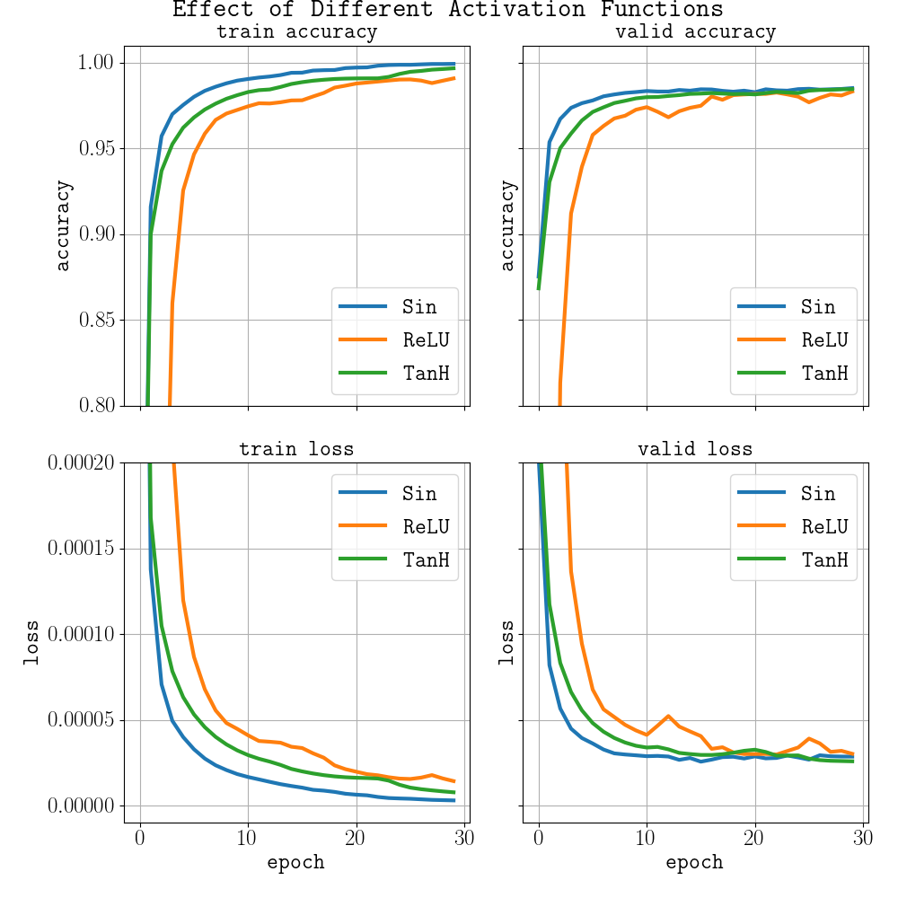

# Some experiments with PyTorch layers

## Trigonometric Activations on LeNet + MNIST

Instead of using `TanH` activation, what if we used other trigonometric (+ReLU) activations without changing the optimizer and the learning rate?
Just replace and use out of the box. Well here are the results.

